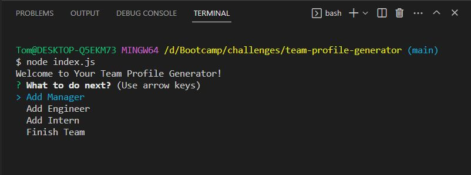
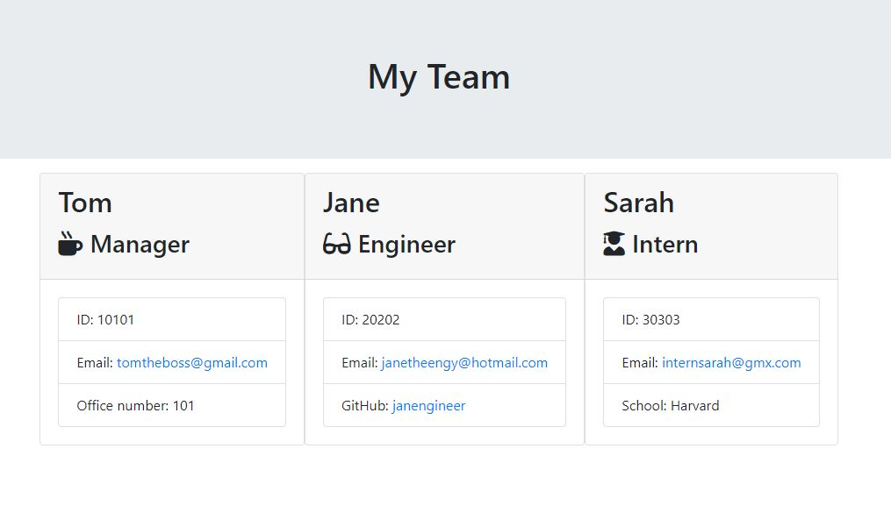

# team-profile-generator

This project encapsulates a command-line application that takes in information about employees on a software engineering team, then generates an HTML webpage that displays summaries for each person on the team. 

The following image shows the application's appearance and functionality:
 

 

The following image shows an example generated HTML file:
 

 

## Description

The project was provided with tests pre-written, so every part of code written passes each provided test.

* User Story
As a user I want to generate a webpage that displays my team's basic info so that I have quick access to their emails and GitHub profiles.

* Application Functionality
    
  * Classes for each team member which pass tests for these classes (in the `test` directory).

    * The first class is an `Employee` parent class with the following properties and methods:       
      * `name`
      * `id`
      * `email`
      * `getName()`
      * `getId()`
      * `getEmail()`
      * `getRole()` returns `'Employee'`

    * The other three classes will extend `Employee`.      
    * In addition to `Employee`'s properties and methods, `Manager` has the following:
      * `officeNumber` (Manager Office No.)
      * `getRole()` overridden to return `'Manager'`

    * In addition to `Employee`'s properties and methods, `Engineer` has the following:
      * `github` (GitHub username)
      * `getGithub()`
      * `getRole()`overridden to return `'Engineer'`

    * In addition to `Employee`'s properties and methods, `Intern` will also have the following:
      * `school`
      * `getSchool()`
      * `getRole()`&mdash;overridden to return `'Intern'`
 
  * Code in `index.js` uses inquirer to gather information about the development team members and creates objects for each team member using the correct classes as blueprints.
    * When a user decides to finish building their team then they exit the application, and the HTML is generated.
    * The HTML generated includes templated divs for each employee.
    * The HTML is written to a file named `team.html` in the `output` folder. 

## Table of Contents

- [Installation](#installation)
- [Usage](#usage)
- [Credits](#credits)
- [License](#license)

## Installation

Simply clone this open source project repository to your local device and invoke within the project Visual Studio Code terminal, or your preferred terminal of choice, using:

$ node index.js

## Usage

The application is a command-line application and is invoked by using the following command:

$ node index.js

You will then be given a series of user prompts for information about your employees/team. Once completed your high-quality, HTML file is generated.

## Credits

N/A

## License

MIT License